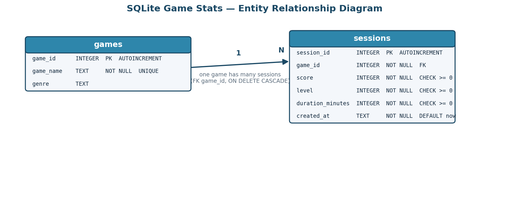
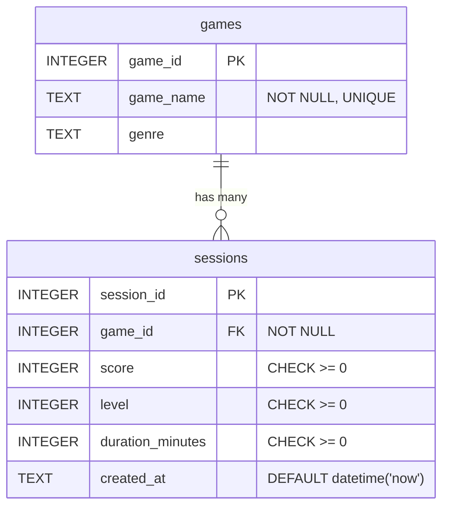

# SQLite Game Stats Tracker

A command-line Python application that records, stores, and queries game session
data using a local **SQLite** database. It demonstrates relational schema design
without an ORM, raw parameterised SQL, and a clean `argparse` CLI — using only the
Python standard library for the core feature set.

> Portfolio Project 01 — Databases / Software Engineering.

## Features

| FR | Capability |
| --- | --- |
| FR-01 | Log a new game session (game, score, level, duration, optional genre & timestamp) |
| FR-02 | Query all sessions for a specific game |
| FR-03 | Show aggregate stats (total sessions, average/highest score, most-played game) |
| FR-04 | Delete a session by ID |
| FR-05 | Database is auto-created and schema-initialised on first run |
| FR-06 | All actions exposed via CLI subcommands |

## Install

```powershell
python -m venv .venv
.\.venv\Scripts\Activate.ps1
pip install -e .[dev]
```

The core CLI needs no third-party packages; `matplotlib` is only required for the
bonus Pareto charts, and `pytest`/`ruff` for development.

## Usage

Run via the installed console script (`game-stats`) or `python -m game_stats`.

### CLI Command Reference (ARTEFACT 01-B)

| Command | Flags | Example | Output |
| --- | --- | --- | --- |
| `log` | `--game` (req), `--score` (req), `--level` (req), `--duration` (req), `--genre`, `--created-at`, `--db-path` | `game-stats log --game "Hades" --score 980 --level 7 --duration 45 --genre Roguelike` | `Logged session 1 for 'Hades'.` |
| `query` | `--game` (req), `--db-path` | `game-stats query --game "Hades"` | One line per session with id, game, genre, score, level, duration, created_at |
| `stats` | `--db-path` | `game-stats stats` | `total_sessions`, `average_score`, `highest_score`, `most_played_game`, `most_played_count` |
| `delete` | `--session-id` (req), `--db-path` | `game-stats delete --session-id 1` | `Deleted session 1.` (exit 1 if not found) |

`--db-path` is optional everywhere and defaults to `stats.db` in the project root.
Scores, levels, and durations must be non-negative (enforced in code **and** by
`CHECK` constraints in the schema).

```powershell
game-stats log --game "Hades" --score 980 --level 7 --duration 45 --genre Roguelike
game-stats query --game "Hades"
game-stats stats
game-stats delete --session-id 1
```

## Data Model (ARTEFACT 01-A)



A `games` lookup table holds one row per distinct game; `sessions` references it via
a `game_id` foreign key (`ON DELETE CASCADE`). The diagram is regenerated with
`python docs/generate_erd.py`.



The raw DDL — with `NOT NULL`, `UNIQUE`, `CHECK`, `FOREIGN KEY`, and supporting
indexes — lives in [`sql/schema.sql`](sql/schema.sql) (ARTEFACT 01-C).

## Project Structure

```text
sqlite-game-stats/
├── README.md
├── pyproject.toml
├── requirements.txt
├── sql/
│   └── schema.sql            # Raw DDL with constraints (01-C)
├── src/game_stats/
│   ├── db.py                 # Connection + schema initialisation
│   ├── queries.py            # CRUD + aggregate SQL functions
│   ├── cli.py                # argparse command definitions
│   ├── pareto.py             # Bonus: Pareto analysis charts
│   └── main.py / __main__.py # Entry points
├── docs/
│   ├── erd.png               # ERD image (01-A)
│   └── generate_erd.py       # Regenerates erd.png
└── tests/                    # pytest suite (in-memory SQLite + Pareto)
```

## Testing

```powershell
pytest --cov=game_stats --cov-report=term-missing
```

Tests use an in-memory SQLite database and cover the database, query, and CLI
layers. Current coverage: **95%** (17 tests).

## Bonus: Pareto Analysis Utility

`game-stats-pareto` renders Pareto charts (bar + cumulative line) from a sample IT
self-assessment questionnaire, illustrating the 80/20 prioritisation pattern. It is
independent of the game-stats feature set and writes images to `docs/pareto/`:

```powershell
game-stats-pareto --output-dir docs/pareto
```
